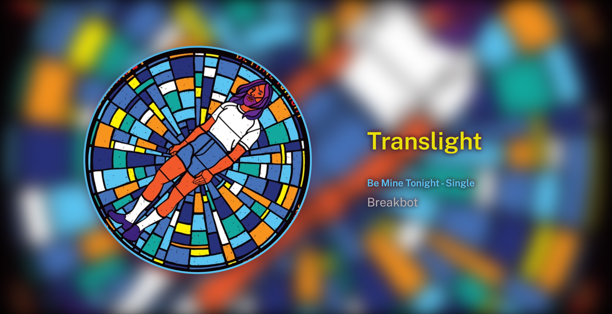
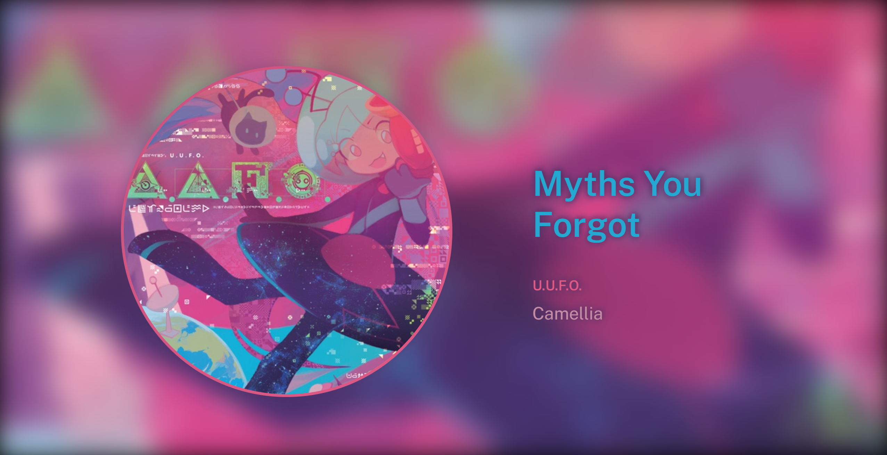

# ShairportGUI

A nice web interface for showing the shairport-sync metadata.



## What did I use?
Built using:
* Node.js
* [shairport-sync-reader](https://www.npmjs.com/package/shairport-sync-reader)
* socket.io
* [node-vibrant](https://www.npmjs.com/package/node-vibrant)
* GitHub Copilot (because I'm learning Node)
* parts of CSS from [neumorphism, pure css](https://codepen.io/b-r-y/pen/wvrXdEd) by Bryanna Lucyk
* the mighty power of `F L E X B O X`


This project is inspired by [Shairport Sync Metadata Display](https://github.com/AlainGourves/shairport-metadata-display) and works similarly, but without any fancy transitions. And has less features ofc.

## Prerequisites
* [shairport-sync](https://github.com/mikebrady/shairport-sync) build with `--with-metadata` option and configured, obviously. Preferably under some Linux distro as that's what the project's been written under. Unless you understand Cygwin pipes. Then teach me. Or you got the UDP working, then it should run just fine under Windows.
* Node.js - used 18.1.0, other versions should also work.

## Run
```
$ npm install
$ node index.js
```

## Notes
This project was build with Raspberry Pi Zero W in mind. While the server part works well on the Pi, the web part is somewhat sluggish, but works well on another computers on the LAN. Also because of this you'll find commented code that *will* work, just not so well on Pi (so animations, some CSS properties etc.). Also this hasn't been tested with many other resolutions than 1080p. there is no vertical mode (fixable with a `@media` query) and the scaling might not look that good on larger resolutions.

Also, the code probably could've been written more cleanly and overall better. Considering this project is still in progress some things may change for the better. Or worse if I become a feature creep.

And yes, I know, move the css and js outside. I know, I tried, and I'm too lazy.
